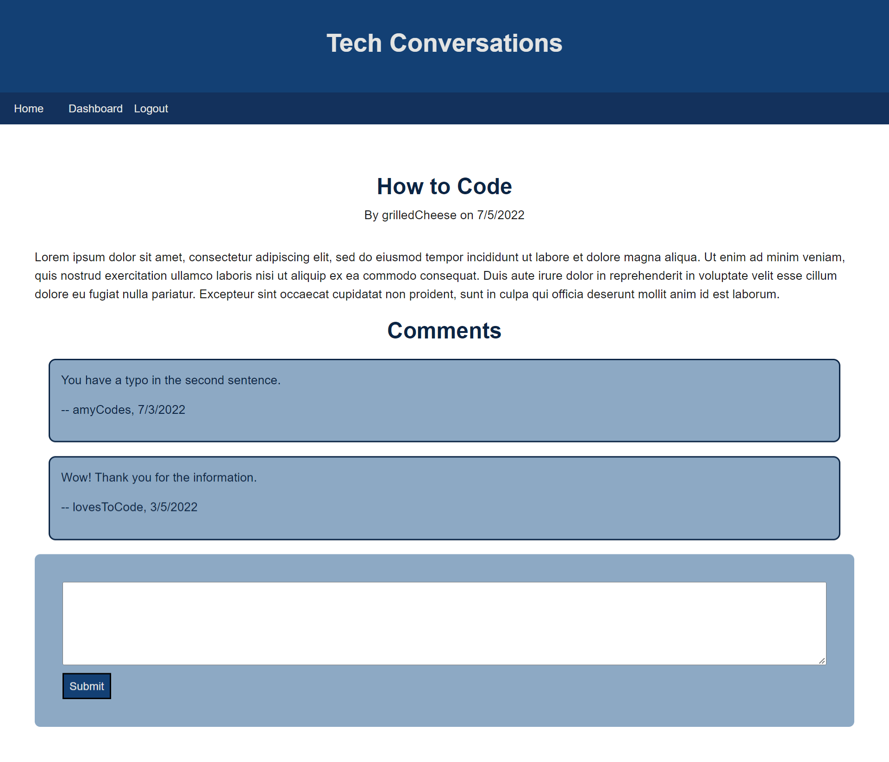
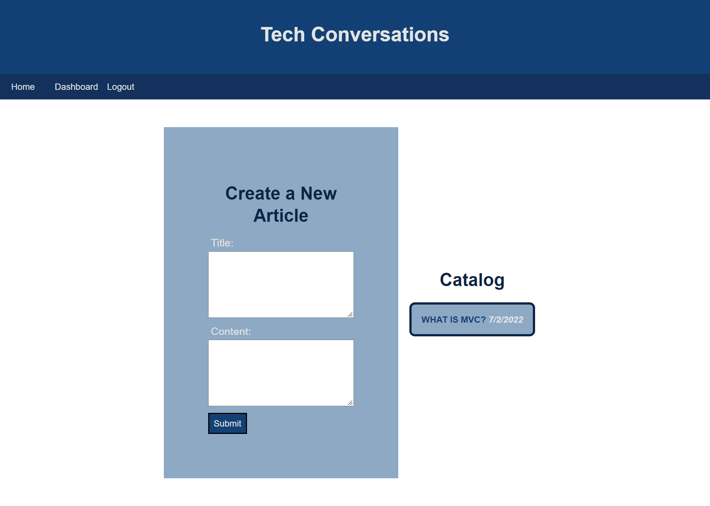

# Tech Blog

[Live Site](https://blooming-hamlet-75697.herokuapp.com/)

## Table of Contents

- [Description](#description)
- [Usage](#usage)
- [Future Development](#future-development)
- [Visuals](#visuals)

## Description

This project is a blog site created with the MVC paradigm using [Handlebars.js](https://handlebarsjs.com/guide/) as the templating language, [Sequelize](https://sequelize.org/) as theORM, and the [express-session](https://www.npmjs.com/package/express-session) npm package for authentication.

Although this project was created from scratch, some code was inspired by activities from the UNCC Web Development Bootcamp.

## Usage

Users can see all articles when first arriving at the homepage. They will need to login or sign up in order to see the article information or create articles of their own. In their dashboard, users can access past posts that they have creates as well as fill out the form in order to create a new post. In articles, user comments appear underneath the content of the article.

## Future Development

Currently, adding comments is broken. This will be fixed in future development. In addition, comments and articles cannot be updated or deleted.

## Visuals

